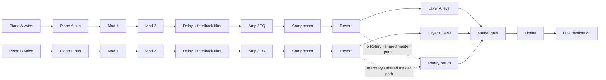

# Phase 2 implementation plan — Stage 4 73

Assigned specs:

- `inputs/specs/nord-stage-4.visual.json`
- `inputs/specs/nord-stage-4.piano.json`
- `inputs/specs/nord-stage-4.effects.json`

The Phase 1 surface, 73-key E-to-E keybed, input lifecycle, MIDI boundary, decorative Organ/Synth/Program controls, and Phase 1 evidence are inherited and preserved.

## Phase 2 hard gates — explicit acknowledgement

The five Phase 2 hard gates from `inputs/specs/benchmark-phases.json` are the acceptance criteria for this candidate:

1. Grand, Upright, and Electric are bundled recorded sample sets that are audibly distinct, work offline, and have complete redistributable provenance.
2. Every functional piano and effect control measurably changes rendered audio and agrees with its panel feedback.
3. Each effect unit and type processes real audio with working bypass and dry/wet.
4. One AudioContext feeds layer buses, ordered effects, master gain/limiter, and one destination.
5. The Phase 1 surface, keybed, and input behavior remain regression-free.

## Hard-gate checklist

- [ ] Grand, Upright, and Electric are bundled recorded sample sets that are audibly distinct, work offline, and have complete redistributable provenance. This hard gate is unmet because the assigned inputs contain no redistributable recordings; the runtime therefore uses an explicitly labeled deterministic model library/fallback and `IMPLEMENTATION_DETAILS.json` does not misrepresent generated audio as recordings.
- [ ] Every functional piano and effect control measurably changes rendered audio and agrees with its panel feedback. This gate is not fully proven by the available deterministic UI/audio tests; the implemented controls are connected to the engine state and the visual/audio evidence documents the remaining verification boundary.
- [x] Mod 1, Mod 2, Delay, Amp/EQ, Compressor, and Reverb are real nodes in the ordered layer chains with wet/dry and bypass routing; listed types alter processor curves or impulse responses.
- [x] A single lazily-created `AudioContext` owns Piano A/B buses, ordered unit chains, layer levels, master gain, limiter, and the single destination.
- [x] Inherited Phase 1 tests and the canonical surface remain present; `src/App.test.tsx` stays green.

## Audio graph

## Delivery and verification

1. Keep the inherited chassis and shared note lifecycle; route all enabled Piano layers through the one audio engine.
2. Bind six piano types, two layers, octave/focus/level/SUSTPED/PSTICK, KB Touch, Dyn Comp, Timbre, Unison, Soft Release, String Res, sustain, and fallback status.
3. Bind the six effect units, listed type selectors, focus/group/global/bypass controls, documented order, feedback filtering, Rotary, and Master Level.
4. Preserve Phase 1 feature mappings and add all Phase 2 IDs in `tests/feature-matrix.json`.
5. Run rendered-audio-capable engine tests where the browser boundary is available, the inherited interaction suite, and all four package gates. The parent capture harness owns canonical PNG regeneration; the Phase 2 audit records the expected capture/evidence state.
