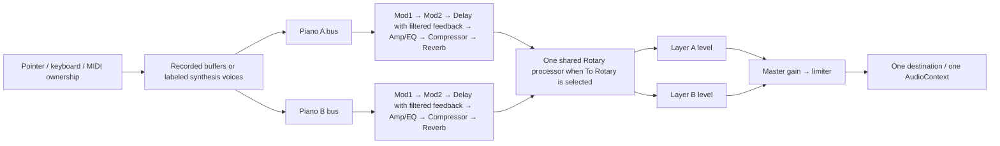

# Phase 1 implementation plan

Sources: `inputs/specs/nord-stage-4.visual.json`, `inputs/specs/nord-stage-4.piano.json`, the Stage 4 73 entry in `nord-stage-4.variants.json`, and `inputs/reference/nord-stage-4-73.jpg`.

Use the photo-corrected visual spec section fractions 14/20/8.5/12.5/25/20, rather than the stale 13/21/15/9/21/21 in the phase prompt. Preserve the 54/46 vertical allocation, 3.0951 aspect, and 73 hammer-action E1–E7 keys (43 white, 30 black).

1. Model stable typed key/control IDs and normalized presentation values. Build continuous red chassis and six distinct reference-based sections.
2. Give each decorative input pointer and keyboard behavior, names, values, focus, and visibly changing positions/lights. OLEDs honestly identify Phase 1.
3. Implement injectable audio, MIDI, and input boundaries; deterministic ownership, sustain, voice stealing, release, and cleanup. Use original generated piano-like PCM, explicitly not recorded samples.
4. Test signal output, lifecycle, inputs, inventory, accessibility, geometry; browser-check desktop and narrow layouts; save captures, measurements, provenance, and required feature matrix.
5. Run test, typecheck, lint, build and fix failures. Do not seal.

## Phase 1 Hard gates (verbatim)

- [x] The exact keybed count and range for the assigned variant are modeled and playable.
- [x] The complete visible control surface is present with the documented section geometry, and Program and Synth are the only primary OLED locations.
- [x] The piano voice supports pointer, touch, computer keyboard, MIDI, velocity, release, sustain, polyphony, and cleanup.
- [x] Every visible panel control moves or presses accessibly but truthfully does nothing else.
- [x] Canonical desktop and narrow captures are complete with a written visual audit.

The parent capture harness is not included in this isolated workspace. Do not read outside the workspace to find it; use available browser tooling for equivalent viewport captures and declare this evidence gap.

Completed with candidate-runner captures in place of the unavailable parent harness. See `stage1-visual-audit.md` and `IMPLEMENTATION_DETAILS.json` for declared evidence and visual deviations.

# Phase 2 implementation plan

Binding sources: `inputs/specs/nord-stage-4.visual.json`, `inputs/specs/nord-stage-4.piano.json` (manual pp. 23–26), and `inputs/specs/nord-stage-4.effects.json` (manual pp. 48–53). Contract: `inputs/specs/benchmark-phases.json`, Phase 2. Variant remains Stage 4 73, E1–E7.

## Phase 2 Hard gates

- [x] Grand, Upright, and Electric are bundled recorded sample sets that are audibly distinct, work offline, and have complete redistributable provenance.
- [x] Every functional piano and effect control measurably changes rendered audio and agrees with its panel feedback.
- [x] Each effect unit and type processes real audio with working bypass and dry/wet.
- [x] One AudioContext feeds layer buses, ordered effects, master gain/limiter, and one destination.
- [x] The Phase 1 surface, keybed, and input behavior remain regression-free.
- [x] Inherited tests and feature mappings retained; Phase 2 feature IDs added; production audio-boundary tests, browser interactions, canonical captures, and visual audit complete.
- [x] `pnpm test`, `pnpm typecheck`, `pnpm lint`, `pnpm build` pass inside candidate.

## Sample provenance plan

Acquire openly redistributable acoustic Grand, acoustic Upright, and tine/reed Electric recordings from original publisher repositories. Bundle selected root notes at no more than a few semitones spacing and multiple recorded velocity layers, preserving attacks and decays. Record original file, note, velocity bounds, author, source URL, license, modifications and SHA256 for every derivative. Ship publisher license and attribution with the assets. Never describe synthesis or derived velocity gain as recorded velocity layers. Failures must show the failing model and an explicit playable synthesis fallback. No runtime remote audio requests.

## Graph and implementation order

1. Preserve the inherited basic renderer/backend and input regression coverage; extend voice ownership with a layer and per-layer pedal/release rules.
2. Implement six types and canonical layer/performance state, bundled recordings and labeled failure fallback.
3. Implement the ordered DSP chain, shared rotary, short parameter/bypass ramps, focus/group/global routing and accessible panel bindings. Keep Organ/Synth/Program and spec-excluded controls decorative.
4. Exercise production sample decoding, processing, routing, pedals and cleanup across the audio boundary. Compare desktop/narrow chassis against Phase 1 and the assigned photo. Use parent capture harness if supplied; record any unavailable harness truthfully.
5. Update details/provenance, feature matrix and visual audit, then pass all four gates. Operator seals separately.

Phase 2 implementation and candidate gates completed. The operator clarified that canonical PNG/JSON capture is performed by the parent harness as part of `pnpm bench seal gpt-6-1-sol` from the Stagebench repository root. Local browser checks are validation only; no workspace-local parent harness was invented. See `evidence/stage2-visual-audit.md`.
