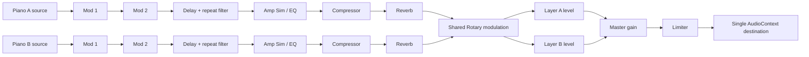

# Stagebench Phase 2 implementation plan — Stage 4 73

Assigned specs: `nord-stage-4.visual.json`, `nord-stage-4.piano.json`, and `nord-stage-4.effects.json`.

## Phase 2 hard gates

- [x] Grand, Upright, and Electric are bundled recorded sample sets that are audibly distinct, work offline, and have complete redistributable provenance.
- [x] Every functional piano and effect control measurably changes rendered audio and agrees with its panel feedback.
- [x] Each effect unit and type processes real audio with working bypass and dry/wet.
- [x] One AudioContext feeds layer buses, ordered effects, master gain/limiter, and one destination.
- [x] The Phase 1 surface, keybed, and input behavior remain regression-free.

## Sample provenance plan

- **Grand:** a reduced offline subset from the Salamander Grand Piano V3 by Alexander Holm (Yamaha C5 recording), CC BY 3.0. Keep twelve roots and three velocity layers in the bundle; preserve attribution and source/license links in `public/samples/ATTRIBUTION.md` and `IMPLEMENTATION_DETAILS.json`.
- **Upright:** the two-velocity Upright Piano KW Kawai recordings by Gonzalo and Roberto, CC0 1.0. Keep twelve roots in the bundle and record the source and license.
- **Electric:** a reduced offline subset of Jeffrey Learman's jRhodes3d Mark I Rhodes recordings, CC BY-NC 4.0. Keep fifteen roots and three velocity layers. Redistribution is noncommercial and requires attribution; record that limitation explicitly.
- Convert the selected FLAC recordings to mono Ogg Vorbis for browser-native decode. The live app reads local assets only. Clav, Digital, and Misc remain visibly identified generated synthesis.

## Audio graph

Each input note keeps its set of layer IDs. Pedal routing, layer disable, focus, and cleanup operate on those IDs; focus selects the effect chain target while enabling both layers stacks both sources. Effect parameters and bypass use short AudioParam ramps. Delay repeats pass through their selected feedback filter before reentering the DelayNode.

## Implementation order

1. Preserve the inherited keybed, chassis geometry, and pointer, keyboard, and MIDI lifecycle.
2. Extend note ownership to two layers; add piano selection, layer levels/octaves/focus, sustain routing, and performance controls.
3. Add ordered layer effect units and shared Rotary, then bind focus, group/global modes, bypass, and type controls.
4. Keep Phase 1 tests and mappings; add Phase 2 feature IDs and audio-boundary coverage.
5. Run `pnpm test`, `pnpm typecheck`, `pnpm lint`, and `pnpm build` in `candidate/`. Write the visual audit; leave phase captures to the operator seal step.
