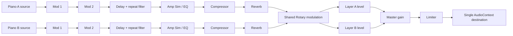

# Stagebench Phase 2 implementation plan — Stage 4 73

Assigned specs: `nord-stage-4.visual.json`, `nord-stage-4.piano.json`, and `nord-stage-4.effects.json`.

## Phase 2 hard gates

- [x] Grand, Upright, and Electric are bundled recorded sample sets that are audibly distinct, work offline, and have complete redistributable provenance.
- [x] Every functional piano and effect control measurably changes rendered audio and agrees with its panel feedback.
- [x] Each effect unit and type processes real audio with working bypass and dry/wet.
- [x] One AudioContext feeds layer buses, ordered effects, master gain/limiter, and one destination.
- [x] The Phase 1 surface, keybed, and input behavior remain regression-free.

## Sample provenance plan

- **Grand:** a reduced offline subset from the Salamander Grand Piano V3 by Alexander Holm (Yamaha C5 recording), CC BY 3.0. Keep twelve roots and three velocity layers in the bundle; preserve attribution and source/license links in `public/samples/ATTRIBUTION.md` and `IMPLEMENTATION_DETAILS.json`.
- **Upright:** the two-velocity Upright Piano KW Kawai recordings by Gonzalo and Roberto, CC0 1.0. Keep twelve roots in the bundle and record the source and license.
- **Electric:** a reduced offline subset of Jeffrey Learman's jRhodes3d Mark I Rhodes recordings, CC BY-NC 4.0. Keep fifteen roots and three velocity layers. Redistribution is noncommercial and requires attribution; record that limitation explicitly.
- Convert the selected FLAC recordings to mono Ogg Vorbis for browser-native decode. The live app reads local assets only. Clav, Digital, and Misc remain visibly identified generated synthesis.

## Audio graph

Each input note keeps its set of layer IDs. Pedal routing, layer disable, focus, and cleanup operate on those IDs; focus selects the effect chain target while enabling both layers stacks both sources. Effect parameters and bypass use short AudioParam ramps. Delay repeats pass through their selected feedback filter before reentering the DelayNode.

## Implementation order

1. Preserve the inherited keybed, chassis geometry, and pointer, keyboard, and MIDI lifecycle.
2. Extend note ownership to two layers; add piano selection, layer levels/octaves/focus, sustain routing, and performance controls.
3. Add ordered layer effect units and shared Rotary, then bind focus, group/global modes, bypass, and type controls.
4. Keep Phase 1 tests and mappings; add Phase 2 feature IDs and audio-boundary coverage.
5. Run `pnpm test`, `pnpm typecheck`, `pnpm lint`, and `pnpm build` in `candidate/`. Write the visual audit; leave phase captures to the operator seal step.

# Stagebench Phase 3 implementation plan — Stage 4 73

Assigned specs: `nord-stage-4.visual.json`, `nord-stage-4.piano.json`, `nord-stage-4.effects.json`, `nord-stage-4.programs.json`, `nord-stage-4.organ.json`, and `nord-stage-4.synth.json`.

## Phase 3 hard gates

- [x] Program save/load round-trips all supported state across the 32 slots and 8 Live slots.
- [x] Splits, crossfades, scenes, morphs, and layer routing are editable from the panel and observable in audio.
- [x] B3, Vox, Farf, and Pipe organ engines and the required Synth source categories are audibly distinct, not renamed copies of one oscillator.
- [x] Organ and Synth route through the Phase 2 graph with no separate AudioContext.
- [x] All inherited visual, piano, effects, and input behavior remains regression-free.

## Canonical state schema

`Stage3State` is the serialized instrument root, stored under `stagebench-stage4-state-v1`. It owns 32 named program slots, 8 auto-saving Live slots, current mode and selection, and the active `InstrumentPatch`. Each patch stores supported Phase 2 Piano and effect parameters (excluding Master Level), Piano zones, two Organ layers, three Synth layers, split points and crossfades, four-zone layer ranges, Scene I/II enable maps, Wheel and Control Pedal positions and assignments, master-clock BPM/sync, and transpose. Engine notes and voices remain transient; all sound-producing configuration is program data.

`AudioConfiguration.modelVariant` selects Studio, Warm, or Bright voicing within the chosen Piano type. It is persisted with that type and changes the piano timbre filter. `IMPLEMENTATION_DETAILS.json` keeps `sampleSources` at the instrument-set level (`name`, `source`, `license`) and lists the selected recording paths, roots, velocity layers, and byte counts separately in `audio.sampleFiles`.

## Control-binding audit

The audit walks every `HARDWARE_CONTROLS` ID against one of four destinations: Phase 2 Piano/effect handling, `changeStage3Control` and `InstrumentPatch`, Program OLED editors and `ProgramDisplay`, or the visible spec-excluded list at the bottom of the surface. Store, Store As, destination selection, Live Mode, split/zone editors, Scenes, morph source capture/interpolation/clear, clock, transpose, and Panic each update canonical state or owned audio voices. Only controls named as excluded in the assigned specs are identified as unsupported; there are no silent handlers that claim an excluded feature works.

## Audio and verification plan

Organ and Synth use six buses created inside the inherited `WebAudioPianoGraph` and connect to its ordered layer effects, master gain, limiter, and single destination. B3 tonewheel partials, Vox/Farf transistor spectra, Farf register switches, Pipe ranks, and each Synth source category have independent generation behavior. Tests cover program and Live persistence, routing/crossfades, morph endpoints, oscillator categories, and the single-context signal boundary while the inherited audio and UI regression suite remains in place.

Run `pnpm test`, `pnpm typecheck`, `pnpm lint`, and `pnpm build` from `candidate/`. The Phase 3 visual audit records source/layout checks and defers screenshots to the operator seal capture.
