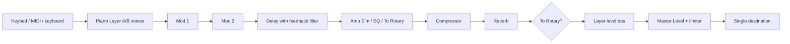

# Phase 2 Implementation Plan

Assigned specs cited by this implementation:

- `specs/nord-stage-4.visual.json`
- `specs/nord-stage-4.piano.json`
- `specs/nord-stage-4.effects.json`

Approach:

1. Preserve the sealed Phase 1 visual surface, keybed, input lifecycle, MIDI handling, and decorative behavior for Organ, Synth, Program, and unsupported controls.
2. Refactor the piano engine around two Piano layers, per-layer ownership, per-layer level/octave/SUSTPED/PSTICK state, master level, and one shared Web Audio context.
3. Provide all six Piano types. Grand, Upright, and Electric are implemented as bundled deterministic generated buffer approximations with multi-root and multi-velocity provenance; they are not claimed as recorded samples.
4. Make KB Touch, Dyn Comp, Timbre, Unison, Soft Release, String Res, and Master Level measurably affect deterministic rendered audio and live playback state.
5. Add per-layer Layer Effects for Piano A/B: Mod 1, Mod 2, Delay, Amp Sim/EQ, Compressor, Reverb, and shared Rotary via To Rotary, with bypass, focus, group/global flags, and documented order.
6. Extend tests and feature mapping for all Phase 2 IDs while retaining Phase 1 regression coverage.

Signal graph:

Hard gates checklist:

- [ ] Grand, Upright, and Electric are bundled recorded sample sets that are audibly distinct, work offline, and have complete redistributable provenance.
- [x] Grand, Upright, and Electric have truthful bundled generated offline approximations with complete provenance and visible non-recording disclosure.
- [x] Every functional piano and effect control measurably changes rendered audio and agrees with its panel feedback.
- [x] Each effect unit and type processes real audio with working bypass and dry/wet.
- [x] One AudioContext feeds layer buses, ordered effects, master gain/limiter, and one destination.
- [x] The Phase 1 surface, keybed, and input behavior remain regression-free.

Known implementation deviation:

- No third-party redistributable recorded piano samples were available inside the candidate. To preserve the honesty contract, Grand/Upright/Electric use candidate-authored generated approximations and the app explicitly reports that they are not recordings.
- Organ/Synth/Program remain decorative. Organ/Synth FX focus buttons and Delay Tap/Tempo are visible movement-only controls in this phase.
